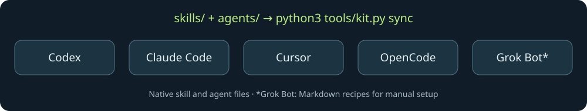

<p align="center">
  
</p>

<p align="center">
  <a href="https://github.com/00200200/maintainer-skills-lab/actions/workflows/ci.yml"></a>
  <a href="https://github.com/00200200/maintainer-skills-lab/stargazers"></a>
  <a href="https://github.com/00200200/maintainer-skills-lab/forks"></a>
  <a href="https://github.com/00200200/maintainer-skills-lab/issues"></a>
  <a href="LICENSE"></a>
</p>

<p align="center">
  <a href="#try-humanizer"><b>Try Humanizer</b></a> ·
  <a href="docs/task-gallery.md"><b>Copy a task prompt</b></a> ·
  <a href="providers/README.md"><b>Explore the skills</b></a> ·
  <a href="https://github.com/00200200/maintainer-skills-lab"><b>☆ Star on GitHub</b></a> ·
  <a href="https://github.com/00200200/maintainer-skills-lab/releases">Download ZIPs</a> ·
  <a href="grok-bot/README.md">Grok Bot</a> ·
  <a href="hooks/README.md">Hooks</a>
  · <a href="docs/skill-watch.md"><b>Skill Watch MCP</b></a>
</p>

# Maintainer Skills Lab

**Make stiff drafts readable. Debug code and ML training with reproducible evidence.**

17 skills and 6 agent profiles for **Codex, Claude Code, Cursor, OpenCode, and Grok Bot**.
The workflows share one Markdown source, with generated versions for each client.
Start with one skill, or get the full library with its agents.

## Try Humanizer

The [Humanizer skill](skills/mkl-humanize/SKILL.md) edits a draft in its original
language, keeping facts, code, quotations, and meaningful caveats intact.

| Before | One possible edit |
| --- | --- |
| We are thrilled to announce that you can now leverage `--dry-run` to preview changes. Windows has not been tested yet. | Use `--dry-run` to preview changes. We haven't tested Windows yet. |

This is an authored illustration. [More examples and acceptance checks →](examples/writing/README.md)

### Install as a Claude Code plugin

In Claude Code, add this repository as a plugin marketplace, then install Humanizer
alone or the full library:

```text
/plugin marketplace add 00200200/maintainer-skills-lab
/plugin install mkl-humanize@maintainer-skills-lab
```

For all 16 skills and 6 agents, install `maintainer-skills-lab@maintainer-skills-lab`
instead. Update with `/plugin marketplace update maintainer-skills-lab`.
[Plugin contents and recorded check →](docs/install.md#claude-code-plugin-marketplace)

### Install one skill

With **Node.js 22.20.0+ and Git**, run this in the project where you want to use it:

```sh
npx skills@1.5.26 add 00200200/maintainer-skills-lab --skill mkl-humanize --agent codex --copy
```

For **Claude Code**, replace `--agent codex` with `--agent claude-code`.
For **Cursor**, use `--agent cursor`. For **OpenCode**, use `--agent opencode`.
This uses the third-party [Vercel Skills CLI](https://github.com/vercel-labs/skills)
to install one skill locally in the current project. Read the linked skill before
installing it.

Then ask your client:

> Use mkl-humanize to improve this draft. Preserve its facts, code, and limitations.
> Explain any edit that changes the emphasis.

Explicit invocation uses `$mkl-humanize` in Codex CLI or `/mkl-humanize` in
Claude Code and Cursor. [Installation, removal, and recorded checks →](docs/install.md#one-skill-with-the-skills-cli)

The skill folder includes a small checker that lists numbers, code, links,
placeholders, quotations, negations, and hedges that a rewrite dropped or added.
Your client can run it after editing, or you can run it yourself:

```sh
python3 .agents/skills/mkl-humanize/scripts/check_facts.py draft.md edited.md
```

Want to see it first? From a source clone, run
`python3 examples/writing/run.py` for a [ready-made demo](examples/writing/README.md#run-the-checker-demo)
that shows both detected changes and a meaningful blind spot, without a client or API key.

That path is for Codex and the Skills CLI's Cursor and OpenCode installs;
Claude Code uses `.claude/skills/`. It needs only Python 3.9+ and does not judge
meaning. [Worked example →](examples/writing/README.md#check-what-the-rewrite-dropped)

Prefer Python? [Install just Humanizer with Python 3.11+](docs/install.md#one-or-more-skills-with-python)
using `--skill mkl-humanize`, with no Node.js dependency. You can also
[install the full library](#start-in-a-minute) or [get a ZIP](https://github.com/00200200/maintainer-skills-lab/releases).
The Python installer is still the way to get native OpenCode agents and the
`.opencode/skills/` copy. [OpenCode setup and invocation →](docs/opencode.md)

Grok Bot uses [manual setup recipes](grok-bot/README.md).

## Find your next useful skill

**[Pick a task and copy its prompt →](docs/task-gallery.md)** Nine starting
points for writing, translation, code review, bug reproduction, and ML debugging.
Each includes the input to bring and what to check in the result.

| You want to… | Start here | What you get |
| --- | --- | --- |
| Keep a consistent writing voice | [Match voice](skills/mkl-match-voice/SKILL.md) | An edit grounded in supplied writing samples |
| Fix a bug with evidence | [Reproduce bug](skills/mkl-reproduce-bug/SKILL.md) → [Verify fix](skills/mkl-verify-fix/SKILL.md) | An observed failure and a comparable check of the fix |
| Debug a training run | [Debug ML training](skills/mkl-debug-ml-training/SKILL.md) | Focused PyTorch, Lightning, and TensorFlow/Keras diagnostics with a [runnable example](examples/ml-training/README.md) |
| Review a pull request | [Review PR](skills/mkl-review-pr/SKILL.md) | Actionable findings with locations and consequences |
| Review changed reference docs | [Review source change](skills/mkl-review-source-change/SKILL.md) | Supported instruction updates, unaffected claims, and gaps that need evidence |
| Review a dependency update | [Review dependency](skills/mkl-review-dependency/SKILL.md) | Compatibility risks, lockfile checks, and a bounded validation plan |
| Explain your project | [Write README](skills/mkl-write-readme/SKILL.md) | An introduction and quickstart grounded in the actual repository |
| Work in Polish and English | [Localize PL ↔ EN](skills/mkl-localize-pl-en/SKILL.md) | Natural wording with commands, placeholders, and meaning preserved |
| Humanize a Polish draft | [Humanize](skills/mkl-humanize/SKILL.md) + [Polish notes](skills/mkl-humanize/references/pl.md) | Stock phrases and English calques replaced, negations and hedges kept |

**[Browse all 17 skills and 6 agents →](providers/README.md)**
Includes tutorials, UX copy, launch posts, maintainer replies, issue triage,
regression tests, and releases. The six agent profiles combine these workflows
for bug investigation, ML training diagnosis, PR review, source-change review,
release editing, and writing.

## Catch outdated agent instructions

**Skill Watch** compares selected source documentation with a saved baseline and
shows which skills, dependent agents, and generated client files need review.
It includes a local scraper, CLI, and optional **MCP server**, with no model or
API key required.

Try an authored change in a disposable project, without network access:

```sh
python3 examples/skill-watch/run.py
```

```diff
-Checkpoints remain enabled during this diagnostic.
+Checkpoints are disabled during this diagnostic.
```

Checks preserve the saved baseline. Accepting a new source version is explicit.
A changed page is a signal to review the instructions, not proof that they are
wrong. [Watch real sources and connect through MCP →](docs/skill-watch.md)

Use [Review source change](skills/mkl-review-source-change/SKILL.md) with the diff
and affected files, or let the [source reviewer](agents/mkl-source-reviewer.toml)
assess them together:

> Use mkl-review-source-change to review this documentation diff against the
> affected skills. Identify supported corrections and instructions that remain
> valid. Flag missing evidence; return a review before making edits.

It also works with a supplied diff, without MCP. [Worked review and acceptance cases →](examples/skill-watch/review.md)

## Debug a loss that looks wrong

Your predictions are `[[1], [3]]`, your labels are `[1, 3]`, and the raw mean
squared residual is **2**. Why isn't it zero? Broadcasting compares every
prediction with every label. Aligning these scalar regression labels produces
the intended per-example loss of **0**.

[Debug ML training](skills/mkl-debug-ml-training/SKILL.md) helps investigate shape
errors, NaNs, missing gradients, and reproducibility problems in **PyTorch,
Lightning, and TensorFlow/Keras**. The
[ML investigator agent](agents/mkl-ml-investigator.toml) combines it with fix
verification. These frameworks are the subject of the task; use the skill in
your existing Codex, Claude Code, Cursor, OpenCode, or Grok Bot setup.

> Use mkl-debug-ml-training to investigate this training failure. Keep the
> current framework and compare one fixed batch before and after the proposed fix.

[Run the CPU example in your framework →](examples/ml-training/README.md)
It checks loss, gradients, and an optimizer update against an analytical result.

## Start in a minute

Get the **full library and native agents** with Python 3.11+. The exporter,
installer, and Skill Watch CLI use only the standard library. The optional MCP
server installs its SDK separately.

```sh
git clone https://github.com/00200200/maintainer-skills-lab.git
cd maintainer-skills-lab

# The destination must be an existing project. Inspect changes first.
python3 tools/kit.py install --target codex --project /path/to/your/repo --dry-run
python3 tools/kit.py install --target codex --project /path/to/your/repo
```

Use `--target claude`, `--target cursor`, or `--target opencode` for the other coding clients. The installer
adds the full library for one target, preserves unrelated files, and refuses
conflicting local edits. Start with one installation method and target per project;
mixed-client discovery is an [untested limitation](docs/compatibility.md).
[Updates, removal, and ZIPs →](docs/install.md)

## One source, five versions



```sh
python3 tools/kit.py sync
```

Editing `skills/mkl-humanize/SKILL.md` generates:

```text
providers/
├── codex/.agents/skills/mkl-humanize/SKILL.md
├── claude/.claude/skills/mkl-humanize/SKILL.md
├── cursor/.cursor/skills/mkl-humanize/SKILL.md
├── opencode/.opencode/skills/mkl-humanize/SKILL.md
└── grok-bot/skills/mkl-humanize.md
```

Agent definitions in `agents/*.toml` combine shared skills. Their generated
versions embed the workflows they need, so a source edit also updates dependent
agents. CI checks that the checked-in copies match their source.

| Client | Get the files | How to use them |
| --- | --- | --- |
| Codex | [Skills + native agents](providers/codex/README.md) | Project-local installation |
| Claude Code | [Skills + native agents](providers/claude/README.md) | Project-local installation |
| Cursor | [Skills + native agents](providers/cursor/README.md) | Project-local installation |
| OpenCode | [Skills + native subagents](providers/opencode/README.md) | Project-local installation |
| Grok Bot (SpaceXAI) | [Skill + agent recipes](providers/grok-bot/README.md) | Set up in the Bot, try a task, then save the workflow as a skill |

Grok Bot recipes follow the [official x.ai documentation](https://docs.x.ai/grok-bot/skills-routines-and-automations).
They are Markdown instructions for manual setup; copying them does not create a Bot.
[Issue Scout and Release Reporter](grok-bot/README.md) include first-task prompts and optional routines.

## Catch incomplete commits with a hook

Changed a skill but forgot to stage its generated versions? The optional
[staged export guard](hooks/README.md) catches that before the commit is created.
It checks the exact staged files, so a correct working tree cannot hide stale
provider copies in the index. Unstaged edits are left alone.

```sh
python3 -B tools/check_staged.py
```

For contributors to this library and its forks. [Setup, examples, and limits →](hooks/README.md)

## Check the evidence

Run a complete local regression example without a model or API key:

```sh
python3 examples/bugfix/run.py
```

```text
Baseline:  assertion-failure
Candidate: pass
Verified for this fixture: True
This checks the bundled example, not agent performance.
```

The same independent test runs against both implementations in fresh Python
processes. [Inspect the fixture and its limits →](examples/bugfix/README.md)

**Preview status:** source/export checks and tool/fixture tests are automated.
Humanizer installation and removal with Skills CLI 1.5.26 were checked for all
three original coding-client targets (Codex, Claude Code, Cursor).
[OpenCode 1.18.30 discovery and agent loading](examples/opencode/README.md) were
checked on macOS arm64. Other live-client discovery, model outcomes, writing
quality, and Grok Bot execution have not yet been evaluated. Native agents inherit model and execution policy from the host.
[Compatibility matrix](docs/compatibility.md) · [Evaluation guide](evals/README.md)

## Make it useful for you

Missing a workflow or found a rough edge? [Open an issue](https://github.com/00200200/maintainer-skills-lab/issues/new)
with the task and a small example. To contribute a skill, edit one source and
generate the client versions: [contribution guide](CONTRIBUTING.md).
You can also [contribute one task recipe](CONTRIBUTING.md#contribute-a-task-recipe)
for an existing skill, with sample input and a clear way to assess its result.

If a skill earns a place in your workflow,
**[star the repository](https://github.com/00200200/maintainer-skills-lab)** to find it again.
To hear about changes, use GitHub's **Watch → Custom → Releases**.

## Community, in numbers

[](https://github.com/00200200/maintainer-skills-lab/stargazers)

Badges above refresh through Shields and GitHub and may be cached. This chart is a
dated snapshot of GitHub data, refreshed alongside substantive changes. Views and
unique visitors cover GitHub's returned **14-day window**. The star chart groups
**current** stargazers by their original star date; removed stars are excluded.
[Aggregate data](assets/community.json) · [How it is generated](assets/README.md)

<details>
<summary><b>Develop and build locally</b></summary>

```sh
python3 tools/kit.py list
python3 tools/kit.py check
python3 tools/kit.py sync --check
python3 -m unittest discover -s tests -v
python3 examples/bugfix/run.py
python3 tools/kit.py build
```

Builds produce five deterministic ZIPs in `dist/`. CI checks Python 3.11 and 3.13
on Linux and macOS and uploads archives as run artifacts. Check the linked run
for the revision you intend to use. The checker validates this repository's
small authoring format; it is not a general YAML validator or a live-model benchmark.

</details>

## Credits and license

[blader/humanizer](https://github.com/blader/humanizer) is a related project in the
same problem space. This library's writing workflows and worked examples are authored here.

[MIT](LICENSE). Independent community project; not affiliated with or endorsed
by OpenAI, Anthropic, Cursor, OpenCode, or SpaceXAI/xAI.
