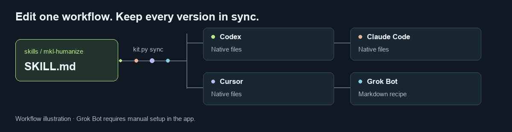
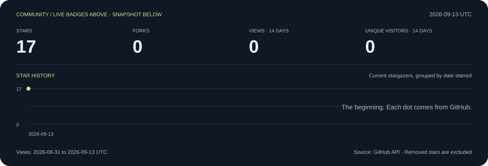

<p align="center">
  
</p>

<p align="center">
  <a href="https://github.com/00200200/maintainer-skills-lab/actions/workflows/ci.yml"></a>
  <a href="https://github.com/00200200/maintainer-skills-lab/stargazers"></a>
  <a href="https://github.com/00200200/maintainer-skills-lab/forks"></a>
  <a href="https://github.com/00200200/maintainer-skills-lab/issues"></a>
  <a href="LICENSE"></a>
</p>

<p align="center">
  <a href="providers/README.md"><b>Explore the skills</b></a> ·
  <a href="#start-in-a-minute">Install</a> ·
  <a href="grok-bot/README.md">Grok Bot</a> ·
  <a href="hooks/README.md">Hooks</a> ·
  <a href="CONTRIBUTING.md">Add your own</a>
</p>

# Maintainer Skills Lab

**Turn a vague issue into a reproduction. Turn a wordy draft into something worth reading.**

Practical skills and focused agents for **Codex, Claude Code, Cursor, and Grok Bot**.
Write the instructions once in Markdown; generate the client versions together.
Start with a workflow you actually need, read what it does, and make it yours.

## Find your first useful skill

| You want to… | Start here | What you get |
| --- | --- | --- |
| Make a draft sound natural | [Humanizer](skills/mkl-humanize/SKILL.md) | Clearer prose with the author's facts and intent intact |
| Keep a consistent writing voice | [Match voice](skills/mkl-match-voice/SKILL.md) | An edit grounded in supplied writing samples |
| Fix a bug with evidence | [Reproduce bug](skills/mkl-reproduce-bug/SKILL.md) → [Verify fix](skills/mkl-verify-fix/SKILL.md) | An observed failure and a comparable check of the fix |
| Review a pull request | [Review PR](skills/mkl-review-pr/SKILL.md) | Actionable findings with locations and consequences |
| Explain your project | [Write README](skills/mkl-write-readme/SKILL.md) | An introduction and quickstart grounded in the actual repository |
| Work in Polish and English | [Localize PL ↔ EN](skills/mkl-localize-pl-en/SKILL.md) | Natural wording with commands, placeholders, and meaning preserved |

**[Browse every skill and agent →](providers/README.md)**
Includes tutorials, UX copy, launch posts, maintainer replies, issue triage,
regression tests, and releases. The four agent profiles combine these workflows
for bug investigation, PR review, release editing, and writing.

### A small taste

Give the Humanizer this draft:

> We are thrilled to announce that you can now leverage `--dry-run` to preview
> changes. Windows has not been tested yet.

One possible edit:

> Use `--dry-run` to preview changes. We haven't tested Windows yet.

The command and limitation survive the edit. This is an authored illustration;
see [more writing examples](examples/writing/README.md) for prompts and acceptance checks.

## One source, four versions



```sh
python3 tools/kit.py sync
```

Editing `skills/mkl-humanize/SKILL.md` generates:

```text
providers/
├── codex/.agents/skills/mkl-humanize/SKILL.md
├── claude/.claude/skills/mkl-humanize/SKILL.md
├── cursor/.cursor/skills/mkl-humanize/SKILL.md
└── grok-bot/skills/mkl-humanize.md
```

Agent definitions in `agents/*.toml` combine shared skills. Their generated
versions embed the workflows they need, so a source edit also updates dependent
agents. CI checks that the checked-in copies match their source.

| Client | Get the files | How to use them |
| --- | --- | --- |
| Codex | [Skills + native agents](providers/codex/README.md) | Project-local installation |
| Claude Code | [Skills + native agents](providers/claude/README.md) | Project-local installation |
| Cursor | [Skills + native agents](providers/cursor/README.md) | Project-local installation |
| Grok Bot (SpaceXAI) | [Skill + agent recipes](providers/grok-bot/README.md) | Set up in the Bot, try a task, then save the workflow as a skill |

Grok Bot recipes follow the [official x.ai documentation](https://docs.x.ai/grok-bot/skills-routines-and-automations).
They are Markdown instructions for manual setup; copying them does not create a Bot.
[Issue Scout and Release Reporter](grok-bot/README.md) include first-task prompts and optional routines.

## Catch incomplete commits with a hook

Changed a skill but forgot to stage its generated versions? The optional
[staged export guard](hooks/README.md) catches that before the commit is created.
It checks the exact staged files, so a correct working tree cannot hide stale
provider copies in the index. Unstaged edits are left alone.

```sh
python3 -B tools/check_staged.py
```

For contributors to this library and its forks. [Setup, examples, and limits →](hooks/README.md)

## Start in a minute

**Python 3.11+**, with no third-party dependencies for the library tools.

```sh
git clone https://github.com/00200200/maintainer-skills-lab.git
cd maintainer-skills-lab

# The destination must be an existing project. Inspect changes first.
python3 tools/kit.py install --target codex --project /path/to/your/repo --dry-run
python3 tools/kit.py install --target codex --project /path/to/your/repo
```

Use `--target claude` or `--target cursor` for the other coding clients. The installer
adds the full library for one target, preserves unrelated files, and refuses
conflicting local edits. For just one workflow, copy its folder from the
[provider catalogue](providers/README.md). [Updates, removal, and ZIPs →](docs/install.md)

Once your client discovers the skills, try:

> Use mkl-humanize to improve this draft. Preserve its facts, code, and limitations.
> Explain any edit that changes the emphasis.

Explicit invocation uses `$mkl-humanize` in Codex CLI or `/mkl-humanize` in
Claude Code and Cursor. Start with one target per project; mixed-client discovery
is an [untested limitation](docs/compatibility.md).

## Check the evidence

Run a complete local regression example without a model or API key:

```sh
python3 examples/bugfix/run.py
```

```text
Baseline:  assertion-failure
Candidate: pass
Verified for this fixture: True
This checks the bundled example, not agent performance.
```

The same independent test runs against both implementations in fresh Python
processes. [Inspect the fixture and its limits →](examples/bugfix/README.md)

**Preview status:** source/export checks and tool/fixture tests are automated.
Live-client discovery, writing quality, and Grok Bot execution have not yet been
evaluated. Native agents inherit model and execution policy from the host.
[Compatibility matrix](docs/compatibility.md) · [Evaluation guide](evals/README.md)

## Bring your own workflow

Built a skill that saves you time? Bring the use case and a small example.
You can contribute without implementing a whole agent or understanding every provider.

- **[Suggest a skill, agent, or hook](https://github.com/00200200/maintainer-skills-lab/issues/new?template=workflow.yml)** — describe the job, input, and useful result.
- **[Report a bug or client mismatch](https://github.com/00200200/maintainer-skills-lab/issues/new?template=bug_report.yml)** — share the smallest reproduction and the client version.
- **[Open a pull request](CONTRIBUTING.md)** — add one source skill, run `sync`, and include a worked example.

A good first contribution is a clearer example, a reproducible compatibility
report, or a small improvement to a workflow you used. **[Contribution guide →](CONTRIBUTING.md)**

If a skill earns a place in your workflow, **star the repository** to find it again.
To hear about changes, use GitHub's **Watch → Custom → Releases**.

## Community, in numbers

[](https://github.com/00200200/maintainer-skills-lab/stargazers)

Badges above refresh through Shields and GitHub and may be cached. This chart is a
dated snapshot of GitHub data, refreshed alongside substantive changes. Views and
unique visitors cover GitHub's returned **14-day window**. The star chart groups
**current** stargazers by their original star date; removed stars are excluded.
[Aggregate data](assets/community.json) · [How it is generated](assets/README.md)

<details>
<summary><b>Develop and build locally</b></summary>

```sh
python3 tools/kit.py list
python3 tools/kit.py check
python3 tools/kit.py sync --check
python3 -m unittest discover -s tests -v
python3 examples/bugfix/run.py
python3 tools/kit.py build
```

Builds produce four deterministic ZIPs in `dist/`. CI checks Python 3.11 and 3.13
on Linux and macOS and uploads archives as run artifacts. Check the linked run
for the revision you intend to use. The checker validates this repository's
small authoring format; it is not a general YAML validator or a live-model benchmark.

</details>

## Credits and license

[blader/humanizer](https://github.com/blader/humanizer) is a related project in the
same problem space. This library's writing workflows and worked examples are authored here.

[MIT](LICENSE). Independent community project; not affiliated with or endorsed
by OpenAI, Anthropic, Cursor, or SpaceXAI/xAI.
