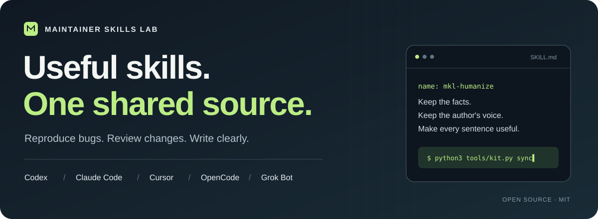

<div align="center">
  

  <h1>Maintainer Skills Lab</h1>
  <p><b>Level up your agentic workflows with 17 specialized skills for Codex, Claude Code, Cursor, OpenCode, and Grok Bot.</b></p>

  <p>
    <a href="https://github.com/00200200/maintainer-skills-lab/stargazers"></a>
    <a href="https://github.com/00200200/maintainer-skills-lab/network/members"></a>
    <a href="LICENSE"></a>
  </p>

  <p>
    <a href="#quick-start"><b>Quick Start</b></a> •
    <a href="#the-skills"><b>The Skills</b></a> •
    <a href="providers/README.md"><b>Supported Clients</b></a> •
    <a href="docs/task-gallery.md"><b>Prompt Gallery</b></a>
  </p>
</div>

---

## 🌟 Why Maintainer Skills Lab?

Write better documentation, debug faster, and code smarter. We provide a single Markdown source for powerful agent workflows, auto-generated for your favorite AI clients.

- **Write like a pro**: Humanize stiff drafts while preserving facts and code.
- **Fix bugs with evidence**: Reproduce bugs and verify fixes locally.
- **Debug ML like magic**: Diagnose PyTorch, Lightning, and TensorFlow issues instantly.
- **Review with confidence**: Get actionable insights on PRs and dependency updates.
- **Write once, run anywhere**: `edit one source → sync → native files for each client`.

<div align="center">
  <!-- Placeholder for a compelling asciinema recording or GIF -->
  
</div>

## 🚀 Quick Start

Get started in seconds! Install a specific skill or the entire library.

### 1. Claude Code
```bash
/plugin marketplace add 00200200/maintainer-skills-lab
/plugin install mkl-humanize@maintainer-skills-lab
```

### 2. Cursor, OpenCode, or Codex
Install globally with the Skills CLI (Requires Node.js 22+):
```bash
npx skills@1.5.26 add 00200200/maintainer-skills-lab --skill mkl-humanize --agent claude-code --copy
```
*(Replace `--agent claude-code` with `cursor`, `opencode`, or `codex`)*

### 3. Python Setup
Want everything at once? Use our Python installer:
```bash
git clone https://github.com/00200200/maintainer-skills-lab.git
cd maintainer-skills-lab
python3 tools/kit.py install --target claude --project /path/to/your/repo
```

## 🛠️ The Skills Library

Choose from 17 specialized skills and 6 agent profiles tailored for maintainers.

| Skill | What it does |
|:---|:---|
| 🤖 **[Humanize](skills/mkl-humanize/SKILL.md)** | Rewrite stiff drafts naturally without losing facts. |
| 🐛 **[Reproduce & Fix](skills/mkl-reproduce-bug/SKILL.md)** | Get a verifiable bug reproduction and fix validation. |
| 🔬 **[Debug ML](skills/mkl-debug-ml-training/SKILL.md)** | Root out NaNs, shape errors, and convergence issues. |
| 🔍 **[Review PR](skills/mkl-review-pr/SKILL.md)** | Catch subtle logic errors before you merge. |
| 📖 **[Write README](skills/mkl-write-readme/SKILL.md)** | Auto-generate clear, concise READMEs from your code. |

**[Browse all 17 skills and 6 agents →](providers/README.md)**

<div align="center">
  <!-- Placeholder for workflow animation -->
  
</div>

## 💖 Support the Project

If these skills save you time, **please star the repository on GitHub!** ⭐ 
Your support helps us build more tools for the open-source community.

<details>
<summary><b>Development & Testing</b></summary>

```bash
# Sync generated skill files
python3 tools/kit.py sync

# Run tests
python3 -m unittest discover -s tests -v
```
</details>

## Contribute

See the [contributor guide](CONTRIBUTING.md), [suggest a workflow](https://github.com/00200200/maintainer-skills-lab/issues/new?template=workflow.yml),
[report a bug](https://github.com/00200200/maintainer-skills-lab/issues/new?template=bug_report.yml),
or [propose a token or latency optimization](https://github.com/00200200/maintainer-skills-lab/issues/new?template=optimization.yml).
You can also browse [help-wanted](https://github.com/00200200/maintainer-skills-lab/issues?q=is%3Aopen+is%3Aissue+label%3A%22help+wanted%22)
and [good first issues](https://github.com/00200200/maintainer-skills-lab/issues?q=is%3Aopen+is%3Aissue+label%3A%22good+first+issue%22).

## 📄 License
[MIT](LICENSE). This is an independent community project.
